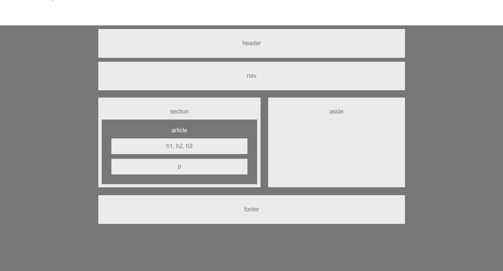

# HW-Wireframe

This is a basic wireframe layout for websites that would have a header, navigation bar, footer, and a section for an article as well as an aside. The header, navigation bar and footer have similar positioning. The section and aside are positioned next to each other.

## Technologies Used
1. [HTML](https://developer.mozilla.org/en-US/docs/Web/HTML)
2. [CSS](https://developer.mozilla.org/en-US/docs/Web/CSS)

## Versioning
1. [Github](https://github.com/)

## Author
- Darryl Tolentino

## Acknowledgements
- Jake Dudum: For bouncing ideas off of and inspiration as we worked on the assignment.